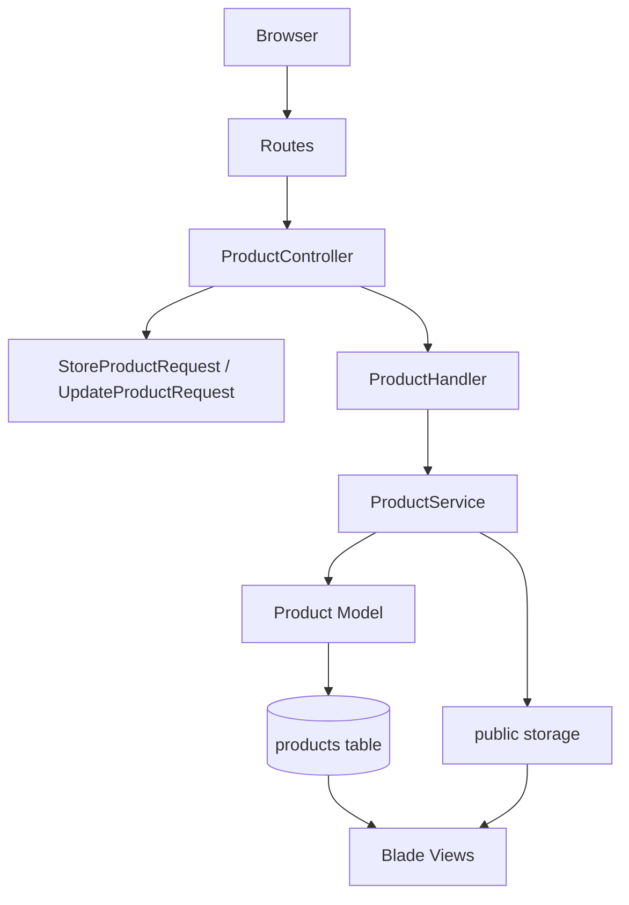

# Assessment Plan Portfolio

This repository contains the deliverables for the **One Month Performance Improvement Plan** for a Trainee Software Engineer.

The work is organized by week and shows progression from frontend fundamentals to Laravel CRUD, validation, error handling, performance, file uploads, and an independent mini project.

## Plan Objective
Strengthen core technical skills, improve code quality, and build independent problem-solving ability through weekly implementation tasks.

Focus areas:
- Clean HTML/CSS structure
- Laravel fundamentals
- Form Request validation
- Controller, handler, and service layering
- Business logic separation
- Error handling
- File upload handling
- Basic performance optimization
- Independent end-to-end delivery

## Repository Structure
```text
Assessment plan/
├── week-1/
│   └── Responsive HTML/CSS UI screens
├── week-2/
│   └── Laravel Product Catalog CRUD
├── week-4/
│   └── Laravel Support Desk mini project
└── README.md
```

There is no separate `week-3/` folder. Week 3 requirements were implemented by improving the existing Week 2 Product Catalog, which was the correct continuation path for the assessment.

## Week 1 - Fundamentals & Structure
Status: Completed

### Focus
- HTML
- CSS
- Responsive layout structure
- Clean code principles
- Code readability

### Completed Work
- Built responsive frontend screens.
- Used semantic HTML structure.
- Organized CSS into reusable files.
- Followed readable naming and folder structure.

### Key Files
- `week-1/src/pages/screen-1.html`
- `week-1/src/pages/screen-2.html`
- `week-1/src/pages/shoes.html`
- `week-1/src/styles/`

## Week 2 - Backend Basics & Validation
Status: Completed

### Focus
- Laravel fundamentals
- Form Request validation
- Business logic handling
- MVC structure

### Project
**Product Catalog CRUD**

The Week 2 project is a Laravel Product Catalog module that demonstrates backend fundamentals through a real CRUD workflow.

### Completed Work
- Created Laravel project in `week-2/`.
- Built Product CRUD: list, create, view, edit, delete.
- Added Product model, migration, controller, request validation, handler, and service layer.
- Used Form Requests for validation.
- Used one `ProductHandler` for use-case orchestration.
- Used `ProductService` for business rules and persistence behavior.
- Removed browser-native HTML validation popups with `novalidate`.
- Displayed real Laravel validation errors beside each field.
- Added feature tests.
- Added shadcn-style Blade UI components.
- Redesigned Week 2 with a distinct dark inventory-dashboard design that is intentionally different from Week 4.

### Layered Architecture


### Important Week 2 Files
- `week-2/app/Http/Controllers/ProductController.php`
- `week-2/app/Handlers/Products/ProductHandler.php`
- `week-2/app/Services/ProductService.php`
- `week-2/app/Http/Requests/StoreProductRequest.php`
- `week-2/app/Http/Requests/UpdateProductRequest.php`
- `week-2/app/Models/Product.php`
- `week-2/resources/views/products/`
- `week-2/resources/views/components/ui/`
- `week-2/tests/Feature/ProductCrudTest.php`
- `week-2/README.md`

### Week 2 UI Work
The Week 2 UI uses reusable Blade components inspired by shadcn/ui patterns:
- `x-ui.button`
- `x-ui.card`
- `x-ui.badge`
- `x-ui.input`
- `x-ui.select`
- `x-ui.textarea`
- `x-ui.label`
- `x-ui.field-error`
- `x-ui.delete-confirmation`

The visual design is a dark “Catalog Control” inventory board with warm amber accents, sharp panels, dense product rows, and custom delete confirmation dialog.

## Week 3 - Performance & Error Handling
Status: Completed inside `week-2/`

### Focus
- Error handling
- File upload handling
- Basic performance optimization

### Completed Work
- Added product image upload.
- Validated uploaded images.
- Stored images on Laravel public storage.
- Replaced old product images when a new image is uploaded.
- Deleted product images when products are deleted.
- Added `ProductOperationException` for user-safe operation failures.
- Added try/catch handling around create, update, and delete flows.
- Optimized product listing by selecting only required columns and using pagination.
- Added feature tests for upload and replacement behavior.

### Important Week 3 Files
- `week-2/app/Exceptions/ProductOperationException.php`
- `week-2/app/Services/ProductService.php`
- `week-2/app/Handlers/Products/ProductHandler.php`
- `week-2/database/migrations/2026_05_12_090000_add_image_path_to_products_table.php`
- `week-2/tests/Feature/ProductCrudTest.php`

## Week 4 - Independent Mini Project
Status: Completed

### Focus
- Independent problem solving
- Planning before coding
- End-to-end delivery
- Reduced reliance on AI
- Time management

### Project
**Support Desk Ticket Tracker**

The Week 4 project is a separate Laravel mini project in `week-4/`. It simulates a real internal support desk workflow.

### Completed Work
- Created Laravel project in `week-4/`.
- Built Ticket CRUD.
- Added dashboard counts.
- Added ticket filters by status, priority, and search keyword.
- Added status workflow.
- Added attachment upload.
- Added Form Request validation.
- Added Controller -> Handler -> Service layering.
- Added shadcn-style Blade components.
- Added feature tests.
- Added Week 4 guide.

### Layered Architecture


### Important Week 4 Files
- `week-4/app/Http/Controllers/TicketController.php`
- `week-4/app/Handlers/Tickets/TicketHandler.php`
- `week-4/app/Services/TicketService.php`
- `week-4/app/Http/Requests/StoreTicketRequest.php`
- `week-4/app/Http/Requests/UpdateTicketRequest.php`
- `week-4/app/Models/Ticket.php`
- `week-4/resources/views/tickets/`
- `week-4/resources/views/components/ui/`
- `week-4/tests/Feature/TicketWorkflowTest.php`
- `week-4/WEEK4_MINI_PROJECT_GUIDE.md`

## How To Run Week 2
```bash
cd "/Users/aselinuke/Desktop/Assessment plan/week-2"
composer install
npm install
php artisan key:generate
php artisan migrate --force
php artisan storage:link
npm run build
php artisan serve --host=127.0.0.1 --port=8000
```

Open:
```text
http://127.0.0.1:8000/products
```

Run tests:
```bash
cd "/Users/aselinuke/Desktop/Assessment plan/week-2"
php artisan test
```

## How To Run Week 4
```bash
cd "/Users/aselinuke/Desktop/Assessment plan/week-4"
composer install
npm install
php artisan key:generate
php artisan migrate:fresh --force
php artisan storage:link
npm run build
php artisan serve --host=127.0.0.1 --port=8001
```

Open:
```text
http://127.0.0.1:8001/tickets
```

Run tests:
```bash
cd "/Users/aselinuke/Desktop/Assessment plan/week-4"
php artisan test
```

## Current Verification Status
Latest local verification completed:
- Week 2: `php artisan test` passed with `10 tests`, `33 assertions`
- Week 2: `npm run build` passed
- Week 4: `php artisan test` passed with `9 tests`, `28 assertions`
- Week 4: `npm run build` passed

## Assessment Outcomes
This repository demonstrates:
- Responsive frontend implementation
- Laravel CRUD development
- Form Request validation
- Real field-level error rendering
- Business logic separation
- Controller, handler, and service layering
- File upload validation and cleanup
- Exception handling
- Basic query optimization
- Reusable Blade UI components
- Automated feature testing
- Independent mini-project delivery

## Recommended Demo Flow
1. Show Week 1 responsive screens.
2. Open Week 2 Product Catalog.
3. Create a product with invalid data to show Laravel validation errors.
4. Create a valid product with an image.
5. Edit the product and replace the image.
6. Show the custom delete confirmation dialog.
7. Run Week 2 tests.
8. Open Week 4 Support Desk.
9. Create a ticket with an attachment.
10. Filter tickets and update ticket status.
11. Run Week 4 tests.
