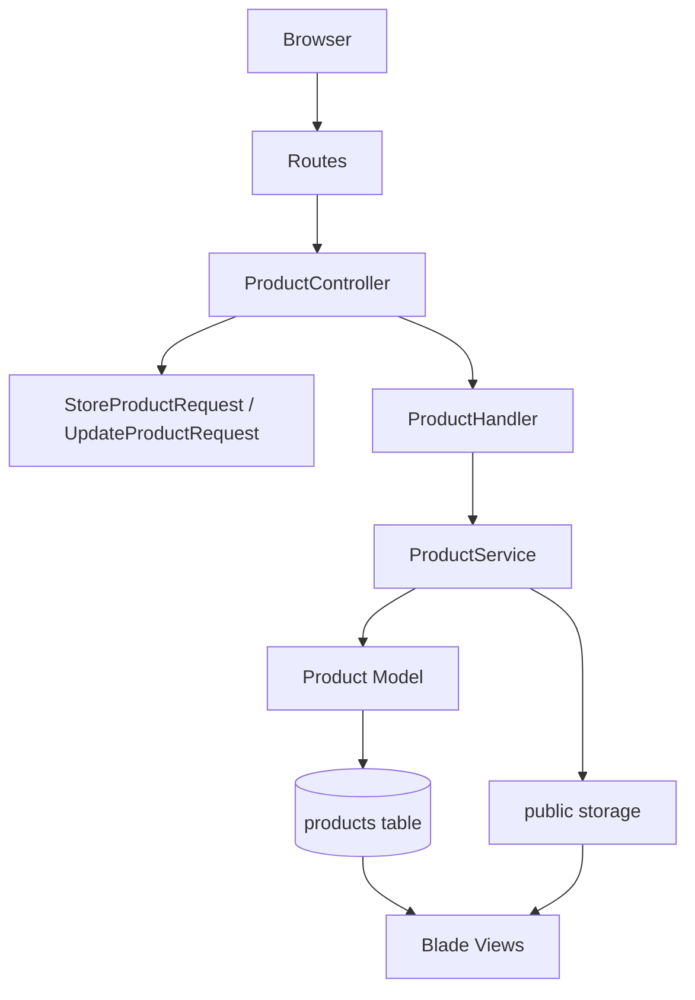

# Assessment Plan Portfolio

This repository contains the deliverables for the **One Month Performance Improvement Plan** for a Trainee Software Engineer.

The work is organized by week and shows progression from frontend fundamentals to Laravel CRUD, validation, error handling, performance, file uploads, and an independent mini project.

## Plan Objective
Strengthen core technical skills, improve code quality, and build independent problem-solving ability through weekly implementation tasks.

Focus areas:
- Clean HTML/CSS structure
- Laravel fundamentals
- Form Request validation
- Controller, handler, and service layering
- Business logic separation
- Error handling
- File upload handling
- Basic performance optimization
- Independent end-to-end delivery

## Repository Structure
```text
Assessment plan/
├── week-1/
│   └── Responsive HTML/CSS UI screens
├── week-2/
│   └── Laravel Product Catalog CRUD
├── week-4/
│   └── Laravel Support Desk mini project
└── README.md
```

There is no separate `week-3/` folder. Week 3 requirements were implemented by improving the existing Week 2 Product Catalog, which was the correct continuation path for the assessment.

## Week 1 - Fundamentals & Structure
Status: Completed

### Focus
- HTML
- CSS
- Responsive layout structure
- Clean code principles
- Code readability

### Key Files
- `week-1/src/pages/screen-1.html`
- `week-1/src/pages/screen-2.html`
- `week-1/src/pages/shoes.html`
- `week-1/src/styles/`

## Week 2 - Backend Basics & Validation
Status: Completed

### Focus
- Laravel fundamentals
- Form Request validation
- Business logic handling
- MVC structure

### Project
**Product Catalog CRUD**

The Week 2 project is a Laravel Product Catalog module that demonstrates backend fundamentals through a real CRUD workflow.

### Layered Architecture


### Week 2 UI Work
The Week 2 UI uses reusable Blade components inspired by shadcn/ui patterns:
- `x-ui.button`
- `x-ui.card`
- `x-ui.badge`
- `x-ui.input`
- `x-ui.select`
- `x-ui.textarea`
- `x-ui.label`
- `x-ui.field-error`
- `x-ui.delete-confirmation`

The visual design is a dark “Catalog Control” inventory board with warm amber accents, sharp panels, dense product rows, and custom delete confirmation dialog.

## Week 3 - Performance & Error Handling
Status: Completed inside `week-2/`

### Focus
- Error handling
- File upload handling
- Basic performance optimization


## Week 4 - Independent Mini Project
Status: Completed

### Focus
- Independent problem solving
- Planning before coding
- End-to-end delivery
- Reduced reliance on AI
- Time management

### Project
**Support Desk Ticket Tracker**

The Week 4 project is a separate Laravel mini project in `week-4/`. It simulates a real internal support desk workflow.

### Layered Architecture


## How To Run Week 2
```bash
cd "/Users/aselinuke/Desktop/Assessment plan/week-2"
composer install
npm install
php artisan key:generate
php artisan migrate --force
php artisan storage:link
npm run build
php artisan serve --host=127.0.0.1 --port=8000
```

Open:
```text
http://127.0.0.1:8000/products
```

Run tests:
```bash
cd "/Users/aselinuke/Desktop/Assessment plan/week-2"
php artisan test
```

## How To Run Week 4
```bash
cd "/Users/aselinuke/Desktop/Assessment plan/week-4"
composer install
npm install
php artisan key:generate
php artisan migrate:fresh --force
php artisan storage:link
npm run build
php artisan serve --host=127.0.0.1 --port=8001
```

Open:
```text
http://127.0.0.1:8001/tickets
```

Run tests:
```bash
cd "/Users/aselinuke/Desktop/Assessment plan/week-4"
php artisan test
```

## Current Verification Status
Latest local verification completed:
- Week 2: `php artisan test` passed with `10 tests`, `33 assertions`
- Week 2: `npm run build` passed
- Week 4: `php artisan test` passed with `9 tests`, `28 assertions`
- Week 4: `npm run build` passed

