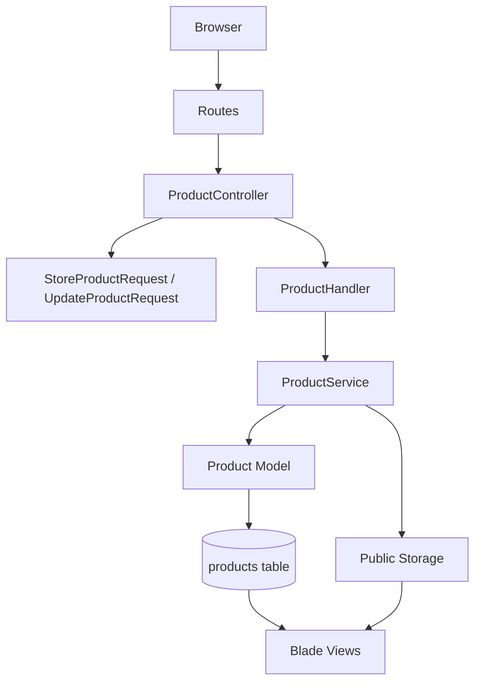

# Week 2 Assessment - Product Catalog

## Objective
Week 2 focuses on Laravel fundamentals, Form Request validation, business logic handling, and clean MVC separation.

The implemented module is a **Product Catalog CRUD** application.

## Features
- List products with pagination
- Create products
- View product details
- Update products
- Delete products
- Upload optional product image
- Validate all user input with Laravel Form Requests
- Show Laravel validation errors beside the real fields
- Use a layered Controller -> Handler -> Service flow
- Use shadcn-style reusable Blade UI components

## Architecture


## Layer Responsibilities
`ProductController`
- Handles HTTP request and response flow
- Calls Form Request validation
- Passes validated payload to `ProductHandler`
- Redirects with success or field errors

`ProductHandler`
- Coordinates product use cases
- Lists, creates, shows, updates, and deletes products
- Keeps controller methods small

`ProductService`
- Applies business logic
- Normalizes product data
- Handles image storage and cleanup
- Enforces archived product transition rule

`StoreProductRequest` and `UpdateProductRequest`
- Validate input
- Normalize text input before validation
- Provide readable validation messages

`Product`
- Defines fillable fields
- Defines casts
- Provides status labels, badge variants, and formatted price helpers

## UI Components
The UI uses shadcn-style Blade components instead of repeating raw HTML and long class lists.

Component location:
```text
resources/views/components/ui
```

Main components:
- `x-ui.button`
- `x-ui.card`
- `x-ui.badge`
- `x-ui.input`
- `x-ui.select`
- `x-ui.textarea`
- `x-ui.label`
- `x-ui.field-error`
- `x-ui.alert`
- `x-ui.page-header`

Example:
```blade
<x-ui.button href="{{ route('products.create') }}">
    Add Product
</x-ui.button>
```

This improves readability because each Blade page describes what it renders instead of repeating low-level styling.

## Validation Behavior
The forms use `novalidate`.

This disables browser-native HTML validation popups so the request reaches Laravel and the user sees real Form Request errors beside each field.

Each input supports:
- `aria-invalid`
- field-specific error messages
- accessible `role="alert"` errors

## Product Fields
- `name`
- `price`
- `stock_qty`
- `status`
- `description`
- `image_path`

Allowed statuses:
- `draft`
- `active`
- `archived`

## Commands
```bash
cd "/Users/aselinuke/Desktop/Assessment plan/week-2"
php artisan migrate:fresh --force
php artisan storage:link
php artisan test
npm install
npm run build
php artisan serve --host=127.0.0.1 --port=8000
```

## Verification
Feature tests cover:
- product creation
- invalid status validation
- real Laravel field error rendering
- image upload validation
- image replacement
- update flow
- delete flow
