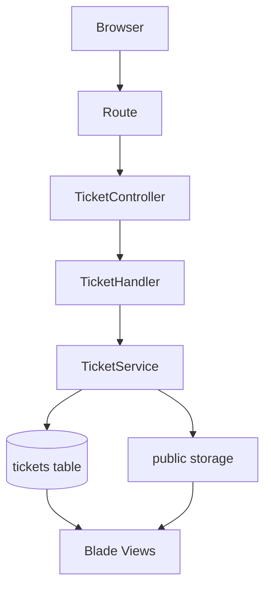

# Week 4 Mini Project Guide - Support Desk

## Project Choice
The Week 4 mini project is a small internal support ticket tracker named **Support Desk**.

This project fits the Week 4 goal because it is end-to-end:
- it starts from planning
- it has a real workflow
- it uses validation and persistence
- it supports file attachments
- it includes filtering and dashboard counts
- it has automated tests

## Scope
Users can:
- create tickets
- view ticket queue
- filter by status, priority, and search keyword
- view ticket details
- update ticket status and resolution notes
- upload an attachment
- delete tickets

## Data Model
Ticket fields:
- `title`
- `requester_name`
- `requester_email`
- `category`
- `priority`
- `status`
- `due_date`
- `description`
- `resolution_note`
- `attachment_path`

Allowed statuses:
- `open`
- `in_progress`
- `resolved`
- `closed`

Allowed priorities:
- `low`
- `medium`
- `high`
- `urgent`

Allowed categories:
- `bug`
- `access`
- `hardware`
- `software`
- `other`

## Architecture


## Why This Structure Was Used
`TicketController` handles HTTP flow only.

`TicketHandler` coordinates use cases:
- dashboard counts
- filtering
- create
- update
- delete

`TicketService` handles business operations:
- normalize inputs
- store attachments
- replace attachments
- delete attachments
- persist tickets

`FormRequest` classes handle validation:
- `StoreTicketRequest`
- `UpdateTicketRequest`

## UI Component Layer
The Week 4 interface uses shadcn-inspired Blade components instead of placing raw HTML and styles everywhere.

The goal is the same idea used by shadcn/ui:
- reusable UI primitives
- variant-based components
- consistent design tokens
- accessible form controls
- clean page templates

Component files are stored in:
```text
resources/views/components/ui
```

Main components:
- `x-ui.button`
- `x-ui.card`
- `x-ui.badge`
- `x-ui.input`
- `x-ui.select`
- `x-ui.textarea`
- `x-ui.label`
- `x-ui.field-error`
- `x-ui.alert`
- `x-ui.stat-card`
- `x-ui.page-header`

Example:
```blade
<x-ui.button href="{{ route('tickets.create') }}">
    New Ticket
</x-ui.button>
```

This keeps the views beginner-friendly because the page describes intent instead of repeating long class lists.

## Styling System
The design tokens live in:
```text
resources/css/app.css
```

Important token groups:
- background and foreground colors
- card colors
- primary and secondary actions
- destructive actions
- borders, inputs, and focus ring

This gives the project a production-style design foundation. If the brand changes later, the main colors can be changed from one place instead of editing every page.

## Readability Decisions
Display formatting was moved into the `Ticket` model:
- `statusLabel()`
- `priorityLabel()`
- `categoryLabel()`
- `statusBadgeVariant()`
- `priorityBadgeVariant()`

This keeps Blade files clean. The views do not need to know how to convert `in_progress` into `In Progress`, or which badge color belongs to each status.

## Validation
Important rules:
- title must be meaningful
- requester email must be valid
- category, priority and status must be known values
- due date cannot be in the past during creation
- attachment must be PDF, image, or TXT
- attachment max size is 4MB

## Testing
Feature tests cover:
- base route redirect
- ticket creation
- validation failure
- attachment upload
- status update
- filtering
- delete flow

Run:
```bash
cd "/Users/aselinuke/Desktop/Assessment plan/week-4"
php artisan test
```

## Demo Script
1. Open `/tickets`
2. Show dashboard counts
3. Create a new ticket
4. Upload an attachment
5. Filter tickets by status or priority
6. Edit the ticket and mark it resolved
7. Add a resolution note
8. Delete a ticket
9. Run tests

## Commands
```bash
cd "/Users/aselinuke/Desktop/Assessment plan/week-4"
php artisan migrate:fresh --force
php artisan storage:link
php artisan test
npm install
npm run build
php artisan serve --host=127.0.0.1 --port=8001
```
